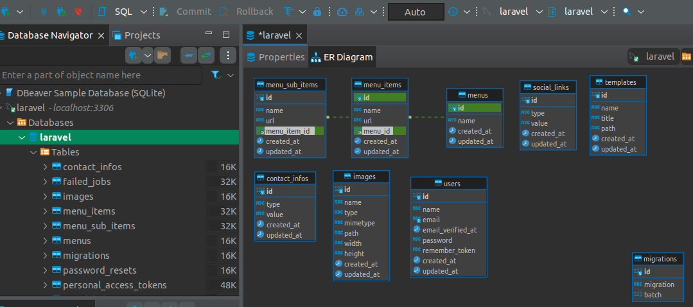

# CMS

Created by: Gustavo Morais

### Composer Main
```json
"autoload": {
    "psr-4": {
        "App\\": "app/",
        "Database\\Factories\\": "database/factories/",
        "Database\\Seeders\\": "database/seeders/",
        "GustavoMorais\\Cms\\": "GusCms/Cms/src"
    }
},
```

### Composer Package
```json
{
    "name": "gustavomorais/cms",
    "description": "cms",
    "license": "MIT",
    "autoload": {
        "psr-4": {
            "GustavoMorais\\Cms\\": "src/"
        }
    },
    "authors": [
        {
            "name": "Gustavo"
        }
    ]
}
```

### config/app.php
```php
'providers' => [
    GustavoMorais\Cms\Providers\CmsServiceProvider::class,
],

'aliases' => Facade::defaultAliases()->merge([
    // 'ExampleClass' => App\Example\ExampleClass::class,
    'GusCmsFacade' => GustavoMorais\Cms\Facades\CmsFacade::class,
])->toArray(),
```

### Cms package command example
```
# gus is the param value
php artisan gus:cms gus
```

### Seed Templates
```
php artisan vendor:publish --tag=cms-seeders
php artisan db:seed --class=TemplateSeeder
php artisan db:seed --class=LinksSeeder
php artisan db:seed --class=ContactInfosSeeder
```

### Run tests
```
php artisan test --filter TemplateTest
```


